# manchabirds

Color palettes I made from photos of Iberian birds (and the odd La Mancha
landscape) so my figures would stop clashing with each other. Same colors in R
and Python, pick your poison.

Most of them come in three flavors:

- plain name → categories (`martin`)
- `_seq` → a gradient (`martin_seq`)
- `_div` → diverging, for data centered on zero like correlations (`martin_div`)

## Install

**R**
```r
remotes::install_github("isi1000/manchabirds", subdir = "R-package")
```

**Python**
```bash
pip install "git+https://github.com/isi1000/manchabirds.git#subdirectory=py-package"
```

## Use them

**R**
```r
library(ggplot2)
library(manchabirds)

ggplot(iris, aes(Sepal.Length, Petal.Length, color = Species)) +
  geom_point() +
  scale_color_manchabirds("martin")

mb_paletas()   # see them all
```

**Python**
```python
import manchabirds as mb

mb.usar_paleta("martin")          # set as the default cycle
mb.registrar_cmaps()              # gradients as "manchabirds_*"
mb.paleta("abejaruco_seq", n = 9) # just the hex codes
```

My favorite for scientific work is `martin` (kingfisher) — orange and blue, plays
nice, colorblind-friendly. But use whichever bird you like.

MIT license, do what you want with it.

---

## The palettes, in action

Every one of them run through the same set of plots (a small immunogenicity
modeling project): dose kinetics, ROC curves, feature importance, an MHC-II
heatmap, a correlation matrix and predicted-probability violins.

<table>
<tr>
<td align="center"><b>avutarda</b> · great bustard<br>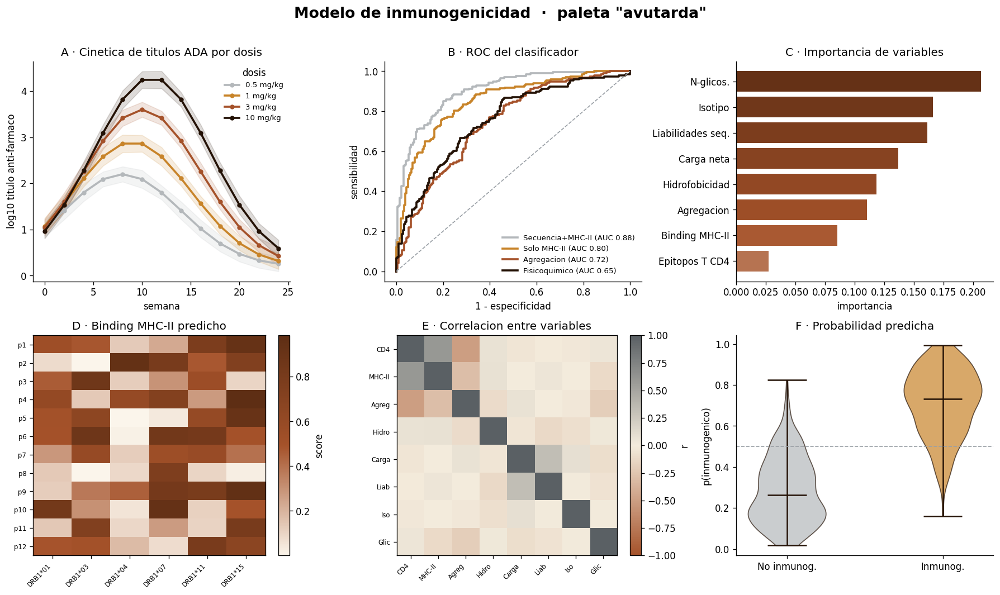</td>
<td align="center"><b>flamenco</b> · flamingo<br>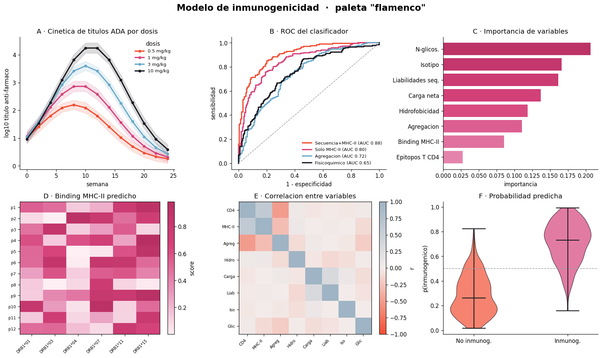</td>
</tr>
<tr>
<td align="center"><b>focha</b> · red-knobbed coot<br>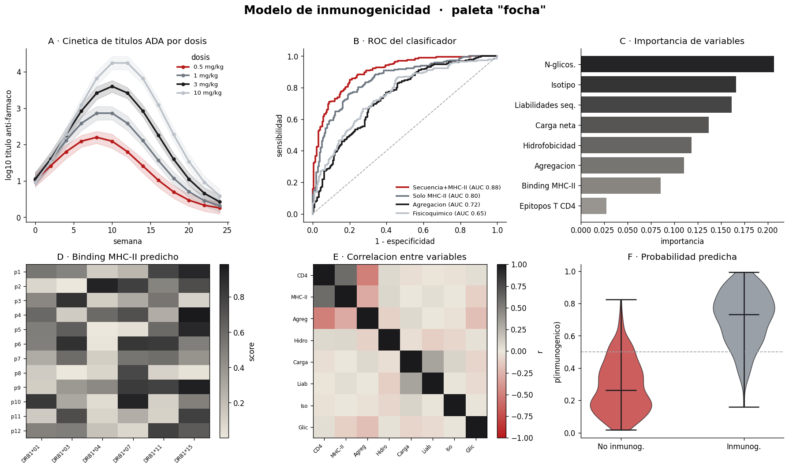</td>
<td align="center"><b>abejaruco</b> · bee-eater<br>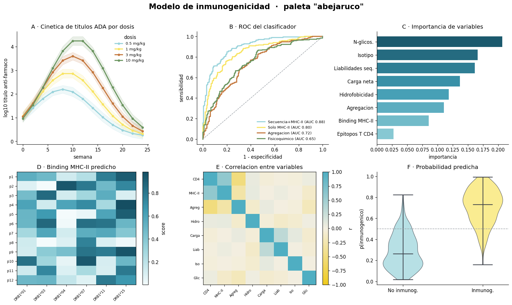</td>
</tr>
<tr>
<td align="center"><b>rabilargo</b> · Iberian magpie<br>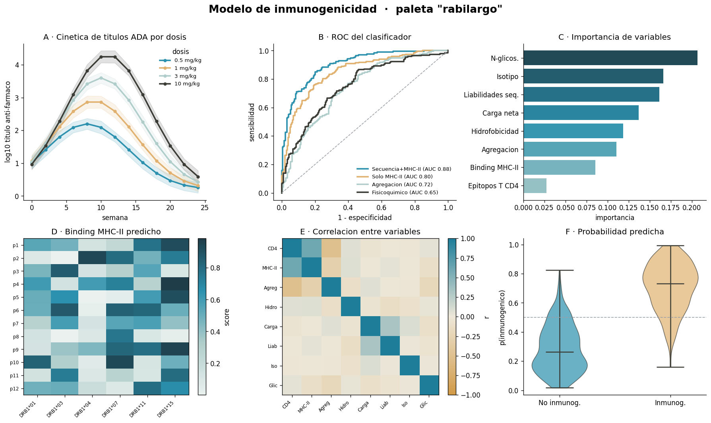</td>
<td align="center"><b>cernicalo</b> · lesser kestrel<br>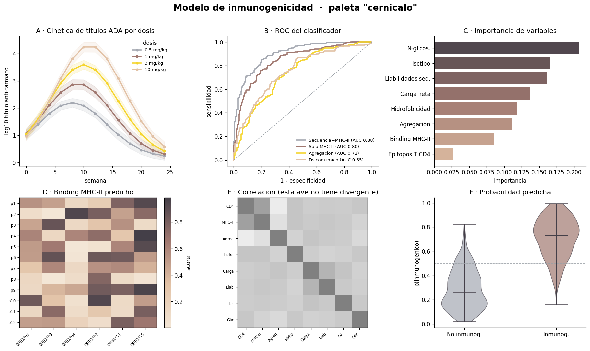</td>
</tr>
<tr>
<td align="center"><b>jilguero</b> · goldfinch<br>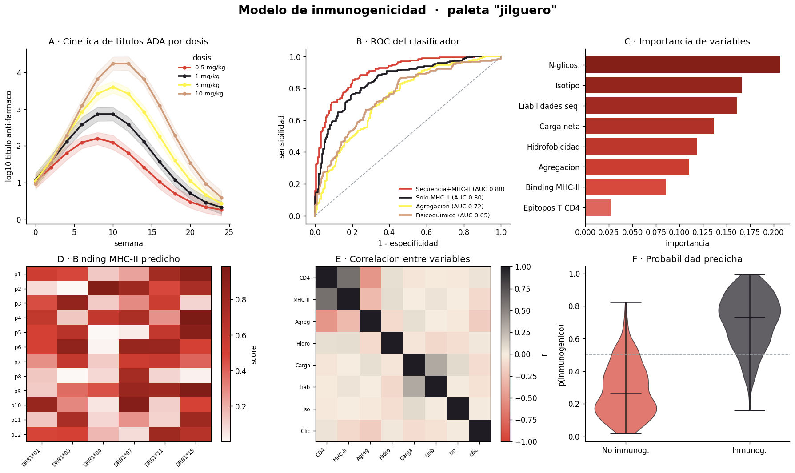</td>
<td align="center"><b>martin</b> · kingfisher<br>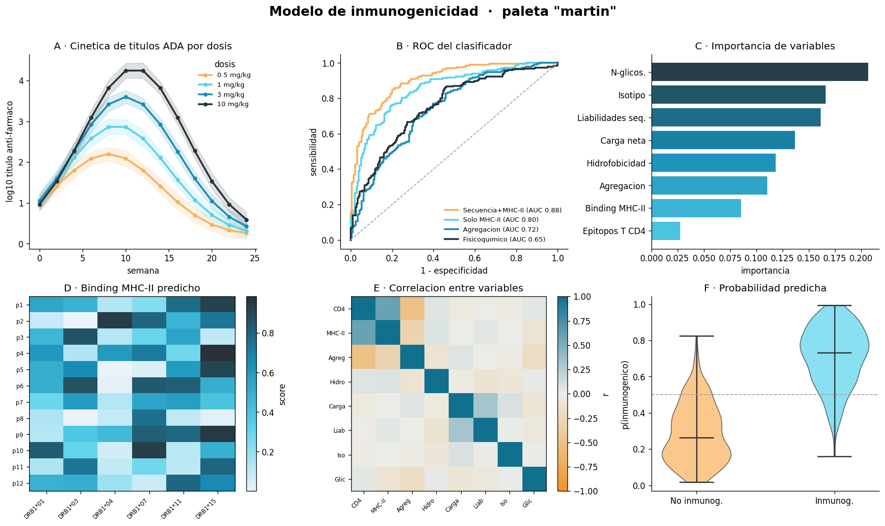</td>
</tr>
<tr>
<td align="center"><b>herrerillo</b> · blue tit<br>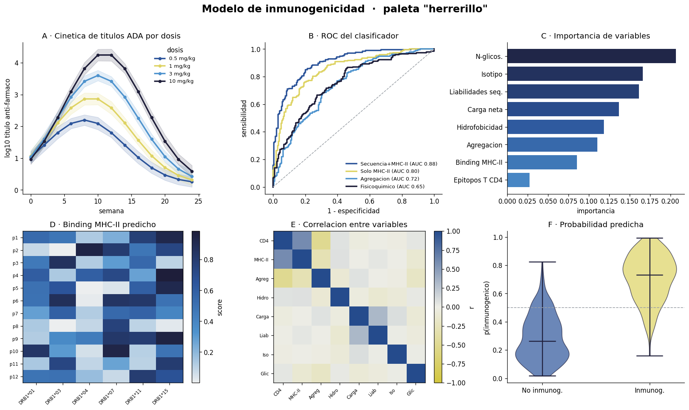</td>
<td align="center"><b>avefria</b> · lapwing<br>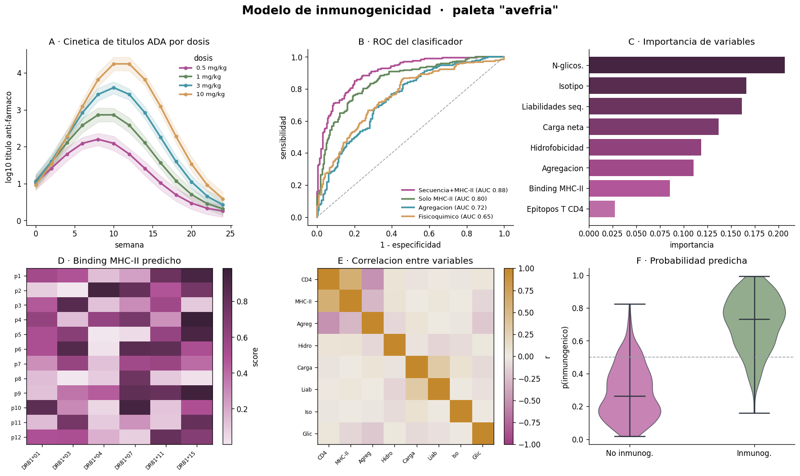</td>
</tr>
<tr>
<td align="center"><b>camachuelo</b> · bullfinch<br>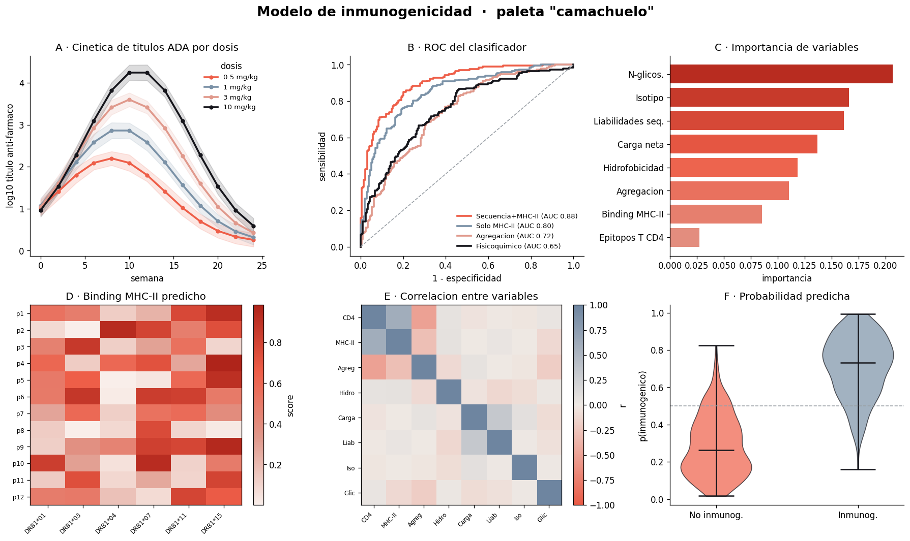</td>
<td align="center"><b>manchego</b> · the La Mancha countryside<br>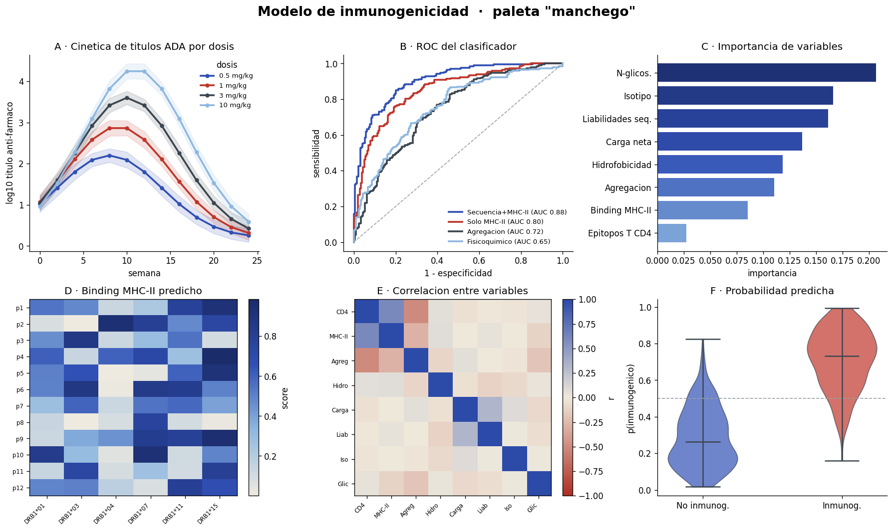</td>
</tr>
</table>
