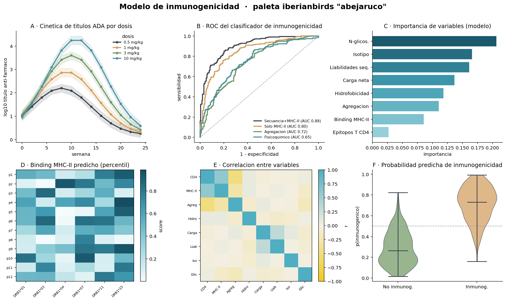
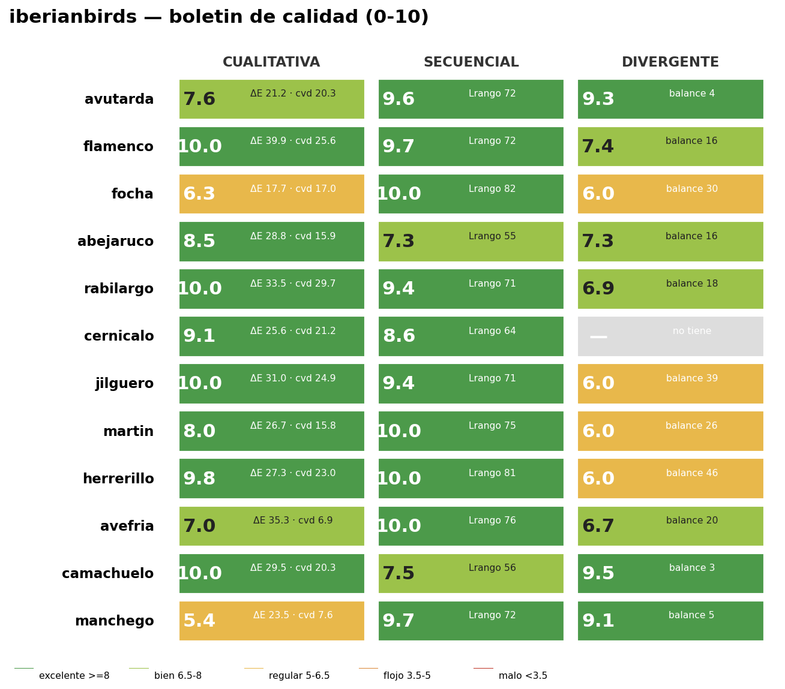

# iberianbirds 🐦

**Cohesive, elegant color palettes inspired by Iberian birds and the landscape
of La Mancha — twin packages for R and Python with exact parity.**

Colors were sampled and tuned from real photographs, then quality-audited
(perceptual distance, colorblind simulation, dynamic range). Designed for
consistent, publication-ready figures in scientific articles.

> The package is called **`iberianbirds`** (what you install and import); it
> lives in the **`manchabirds`** repository — a wink, since most (not all) of
> these birds live in the plains of La Mancha.


---

## ✨ What's inside

- **11 palettes** — 10 birds + the *manchego* landscape.
- Up to **3 variants** each: **qualitative** (categories), **sequential**
  (magnitude) and **diverging** (data with a meaningful center).
- **R** package with `ggplot2` scales, **Python** package for
  `matplotlib`/`seaborn`.
- **Exact R ↔ Python parity** (generated from a single source of truth).
- Colorblind-checked; earthy, understated palettes with a distinct Iberian
  identity.

## 📦 Installation

**R**
```r
# install.packages("remotes")
remotes::install_github("isi1000/manchabirds", subdir = "R-package")
```

**Python**
```bash
pip install "git+https://github.com/isi1000/manchabirds.git#subdirectory=py-package"
```

## 🎨 The palettes

| Palette id | Bird / theme (EN) | Character |
|---|---|---|
| `avutarda` | Great Bustard | ochres, sand, black |
| `flamenco` | Greater Flamingo | pink, coral, magenta, water blue |
| `focha` | Red-knobbed Coot | red, ivory, slate, black |
| `abejaruco` | European Bee-eater | blue, yellow, ochre, green |
| `rabilargo` | Iberian Magpie | teal blue, tan, celadon |
| `cernicalo` | Lesser Kestrel | rufous, blue-grey, yellow *(no diverging)* |
| `jilguero` | European Goldfinch | red, black, yellow, brown |
| `martin` | Common Kingfisher | orange + electric blue |
| `herrerillo` | Eurasian Blue Tit | cobalt, navy, chartreuse |
| `avefria` | Northern Lapwing | magenta, green, teal, gold |
| `camachuelo` | Eurasian Bullfinch | coral, blue-grey, rose |
| `manchego` | La Mancha landscape | indigo, whitewash, red, sky, wheat, earth, vine |

## 🔤 Naming convention

| Variant | Name | Use for |
|---|---|---|
| Qualitative | `abejaruco` | categories (unordered) |
| Sequential | `abejaruco_seq` | magnitude (heatmaps) |
| Diverging | `abejaruco_div` | centered data (correlations, anomalies) |

## 🚀 Usage

**R**
```r
library(ggplot2); library(iberianbirds)

# qualitative
ggplot(iris, aes(Sepal.Length, Petal.Length, color = Species)) +
  geom_point() + scale_color_iberianbirds("abejaruco")

# continuous (sequential or diverging)
ggplot(faithful, aes(waiting, eruptions, color = eruptions)) +
  geom_point() + scale_color_iberianbirds_c("martin_seq")

ib_paletas()   # list everything
```

**Python**
```python
import iberianbirds as ib

ib.usar_paleta("martin")            # default color cycle
ib.registrar_cmaps()                # register "iberianbirds_*" colormaps
plt.imshow(z, cmap="iberianbirds_martin_div")

ib.paleta("abejaruco_seq", n=9)     # list of hex
```

## 🔬 Example: an immunogenicity modeling project

Every chart type of a real project, all with one palette (`abejaruco`):
kinetics, ROC curves, feature importance, MHC-II binding heatmap, feature
correlation and predicted-probability violins.



## ✅ Quality audit

Each palette was scored on category separation (ΔE), colorblind safety and
dynamic range:



## 🛠️ How it's built

`shared/sistema-final.json` is the single source of truth. Running
`python shared/generate_packages.py` regenerates the R and Python data files
from it, guaranteeing byte-for-byte parity of the native colors (interpolated
ramps match within ±1/255).

## 📄 License

[MIT](LICENSE) © 2026 Isidro Sobrino.
Bird reference photographs are **not** included (third-party copyright).
