# manchabirds

Color palettes I made from photos of Iberian birds (and the odd La Mancha
landscape) so my figures would stop clashing with each other. Same colors in R
and Python, pick your poison.

Most of them come in three flavors:

- plain name → categories (`martin`)
- `_seq` → a gradient (`martin_seq`)
- `_div` → diverging, for data centered on zero like correlations (`martin_div`)

## Install

**R**
```r
remotes::install_github("isi1000/manchabirds", subdir = "R-package")
```

**Python**
```bash
pip install "git+https://github.com/isi1000/manchabirds.git#subdirectory=py-package"
```

## Use them

**R**
```r
library(ggplot2)
library(manchabirds)

ggplot(iris, aes(Sepal.Length, Petal.Length, color = Species)) +
  geom_point() +
  scale_color_manchabirds("martin")

mb_paletas()   # see them all
```

**Python**
```python
import manchabirds as mb

mb.usar_paleta("martin")          # set as the default cycle
mb.registrar_cmaps()              # gradients as "manchabirds_*"
mb.paleta("abejaruco_seq", n = 9) # just the hex codes
```

My favorite for scientific work is `martin` (kingfisher) — orange and blue, plays
nice, colorblind-friendly. But use whichever bird you like.

MIT license, do what you want with it.

---

## The palettes

**avutarda** · great bustard
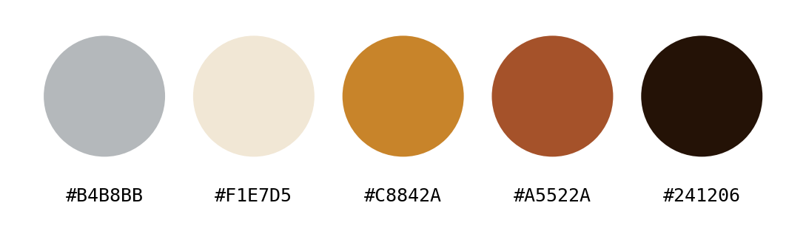

**flamenco** · flamingo
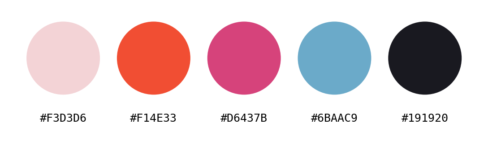

**focha** · red-knobbed coot
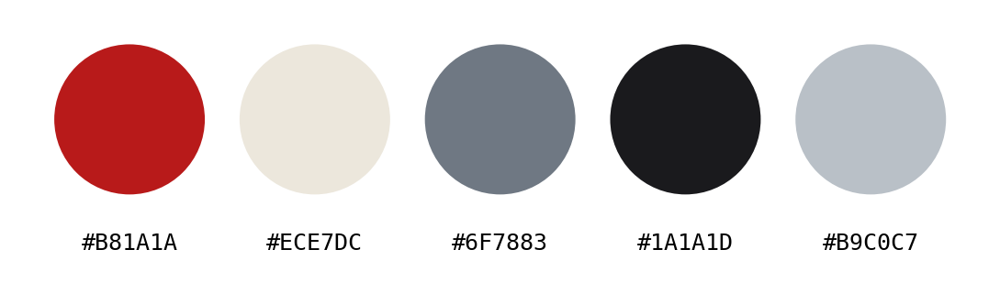

**abejaruco** · bee-eater
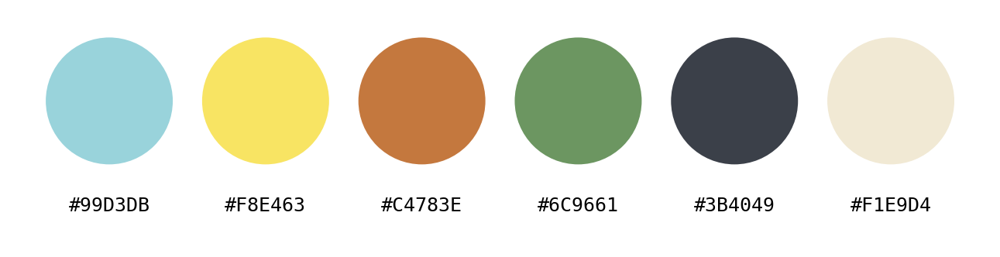

**rabilargo** · Iberian magpie
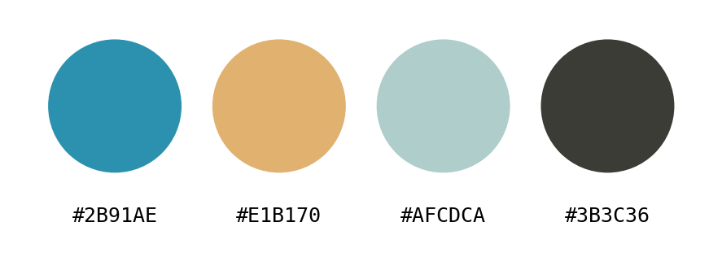

**cernicalo** · lesser kestrel
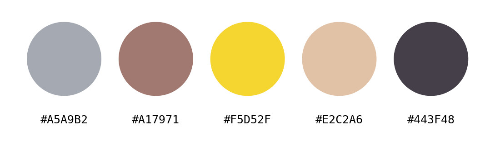

**jilguero** · goldfinch
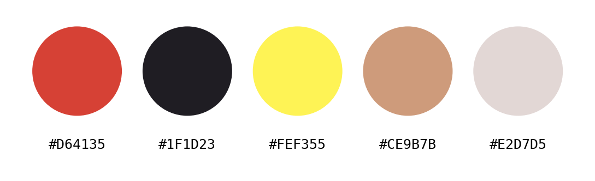

**martin** · kingfisher
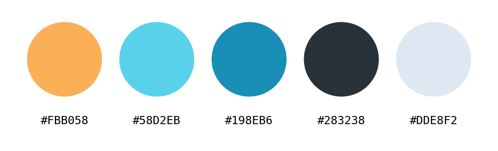

**herrerillo** · blue tit
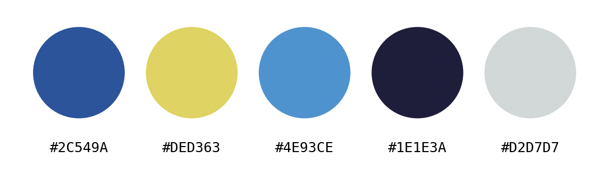

**avefria** · lapwing
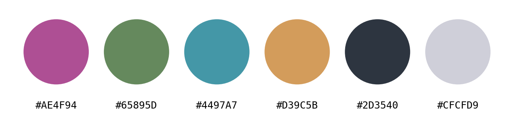

**camachuelo** · bullfinch
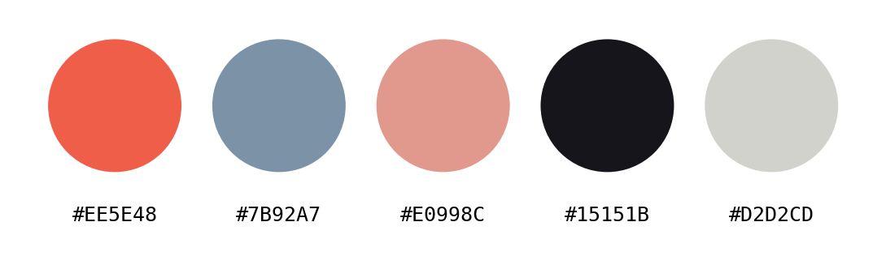

**manchego** · the La Mancha countryside
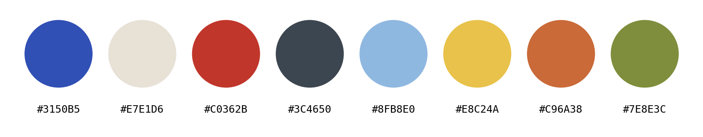
